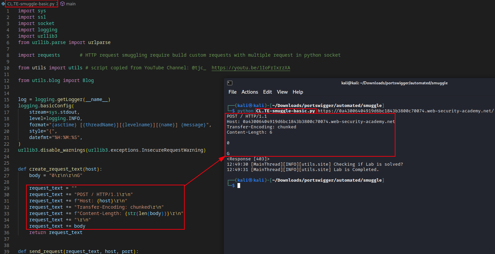

# PortSwigger Academy Lab automation scripts

>Came across this great YouTube channel by [@tjc_](https://www.youtube.com/@tjc_/videos), where he step through the process of writng python scripts to automate the exploitation of the PortSwigger labs.  
  
>I followed his videos and reproduced the python scripts but credit goes to **@tjc_**  

>The utils and other pythons scripts imported into each vulnerability catagory lab is reference with symbolic link, under each sub folder. In below example in the XSS folder there is symbolic link to ../utils folder.

```bash
cd xss/
ln -s ../utils utils
```  

>This create uniform import standard in all scripts.  

## Code Structure

>The is my explanation of the code structure developed by @tjc_.  
  
1. **site.py** contain the class, super-class, attributes, objects and functions reused between the tipe of targets, if it is blog or site, these include the common objects.  
2. **utils.py** is the commong python functions reused in the main program.  
3. **blog.py** is functions used only on targets of a web app of blog purpose.  
4. **shop.py** is the ecommerce web app common python functions.  
5. **Vulnerable_lab_name.py** this is the main app to target the specific type of lab.  
  
>The image below show the payload executed by the python domxss script in an attempt to steal victim cookie. The cookie is secure with HttpOnly flag set.  

  

[Script used in above DOMXSS example](https://github.com/botesjuan/Burp-Suite-Certified-Practitioner-Exam-Study/blob/main/python/xss/domxss-in-jquery-hashchange.py)  
  
>This is simple example of the HTTP request smuggling basic CL.TE lab solved using python script.  

[Smuggle CL.TE basic Python code](https://github.com/botesjuan/Burp-Suite-Certified-Practitioner-Exam-Study/blob/main/python/smuggle/CL.TE-smuggle-basic.py)  
  
  

[Youtube: @tjc_](https://youtu.be/1IoFrIxrzXA)  
  
